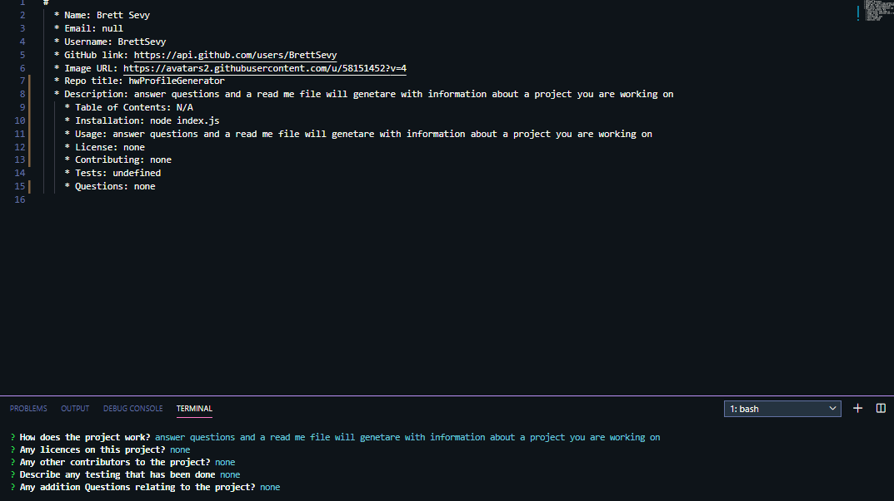

# Profile Generator
<h4 align="center">Node, Axios, Inquirer</h4>



 in node, you answer questions and a read me file will genetare with information about a project you are working on

The generated README includes:
 - name.
 - email.
 - github url.
  - Title(reponame)
  - Description
  - Table of Contents
  - Installation
  - Usage
  - License
  - Contributing
  - Tests
  - Questions

# Demo

Deployment : ```node index.js```

# Technologies used

- [JavaScript](https://developer.mozilla.org/en-US/docs/Web/JavaScript)
- [Node.js](https://nodejs.org/en/)<br>
- [Express](https://www.npmjs.com/package/express)
- [Axios](https://www.npmjs.com/package/axios)
- [Inquirer](https://www.npmjs.com/package/inquirer)


# Author

[Brett Sevy](https://github.com/BrettSevy)

